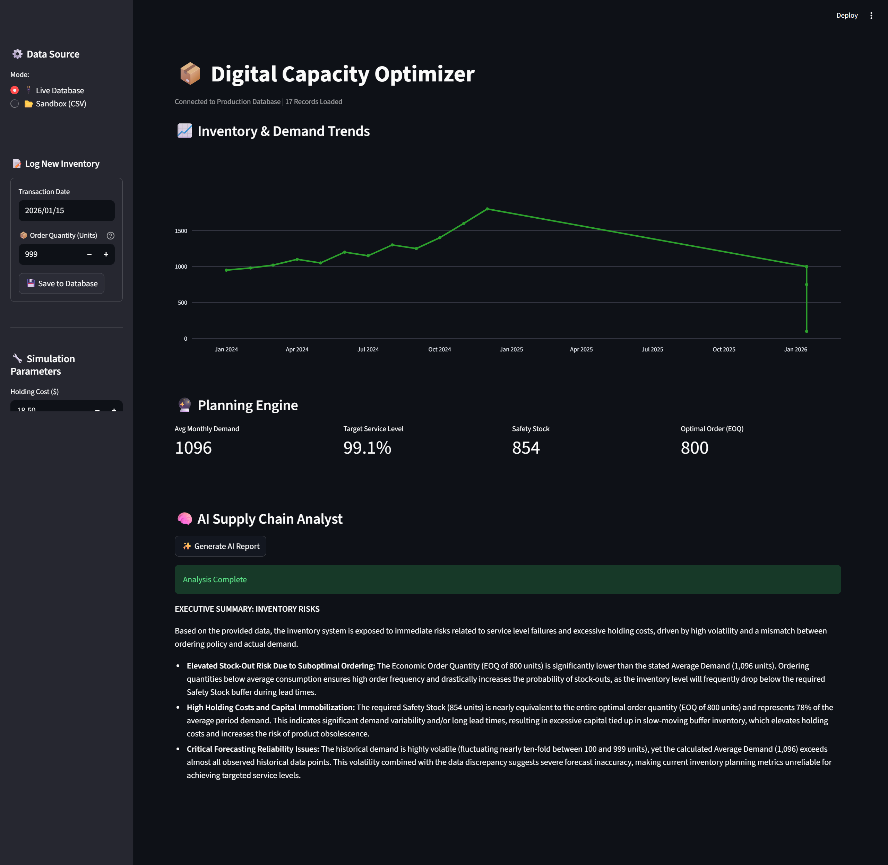

# 🧠 AI-Powered Digital Capacity Optimizer

**Author:** Sandesh Hegde  
**Version:** v2.3.0 (Cognitive Edition)  
**License:** MIT  
  

## 🚀 Live Demo
**[Click here to launch the App](https://digital-capacity-optimizer.onrender.com/)** *(Note: Hosted on Render Free Tier. Please allow 30s for cold start.)*

---

## 📌 Overview

The **Digital Capacity Optimizer** is a Full-Stack Supply Chain Intelligence platform. It goes beyond simple data tracking by integrating **Generative AI** to act as an automated supply chain analyst.

The system connects a live **PostgreSQL** database to **Google's Gemini LLM**, allowing users to not only *see* their inventory levels but *understand* the strategic risks through natural language reports.

### 🖥️ The AI Dashboard


---

## 🏗️ Architecture

The application follows a modern **Cognitive 3-Tier Architecture**:

1.  **Presentation:** Streamlit (UI) + Plotly (Charts)
2.  **Intelligence:** Python Logic (EOQ Models) + **Gemini AI (Reasoning)**
3.  **Data:** PostgreSQL (Production) / SQLite (Sandbox)

**Data Flow:** `User Input` -> `SQL Database` -> `Python Math Engine` -> `LLM Context` -> `Strategic Report`

---

## 🎯 Key Features

### 🧠 Cognitive Intelligence (New)
- **📄 Executive PDF Reporting:** One-click generation of professional PDF summaries for stakeholder meetings.
- **🛡️ AI Guardrails:** Strict negative constraints prevent the AI from answering off-topic questions or hallucinating math.
- **Strategic Recommendations:** Translates math (StdDev, EOQ) into plain English advice.

### 🏭 Core Supply Chain Ops
- **🎛️ Scenario Simulation:** Interactive slider to test "What-If" scenarios (e.g., 95% vs 99% Service Levels) in real-time.
- **🔌 Zero-Touch Loading:** Auto-connects to the cloud database on launch.
- **📝 Read/Write System:** Log new orders directly via the sidebar form.
- **📊 Interactive Charts:** Zoomable demand history and trend lines.
- **💰 Financial Optimization:** Calculates Economic Order Quantity (EOQ) to minimize holding costs.

---

## 📊 How It Works

The system utilizes a hybrid approach of **Deterministic Math** and **Probabilistic AI**:

1.  **The Math:** Calculates the exact Safety Stock needed for a target Service Level (e.g., 99.1%) based on the Simulation Slider.
2.  **The AI:** Analyzes the context (e.g., "Volatility is 10x higher than normal"), sanitizes the output, and compiles a downloadable PDF report.

---

## 🛠️ Tech Stack

- **AI Model:** Google Gemini 2.0 Flash / 1.5 Flash
- **Infrastructure:** Docker, Render (Cloud)
- **Database:** PostgreSQL (Prod), SQLAlchemy ORM
- **Frontend:** Streamlit, Plotly
- **Reporting:** FPDF2 (PDF Generation)
- **Language:** Python 3.11

---

## 🚀 Installation & Usage

### Prerequisites
You need a [Google AI Studio API Key](https://aistudio.google.com/).

### Option A: Run Locally (Python)
```bash
# 1. Clone the repository
git clone [https://github.com/sandesh-s-hegde/digital_capacity_optimizer.git](https://github.com/sandesh-s-hegde/digital_capacity_optimizer.git)
cd digital_capacity_optimizer

# 2. Install dependencies
pip install -r requirements.txt

# 3. Set your AI Key (Windows PowerShell)
$env:GEMINI_API_KEY="AIzaSy...YourKey"

# 4. Launch the Dashboard
streamlit run app.py

```

### Option B: Run with Docker

```bash
# 1. Build the container
docker build -t digital-capacity-optimizer .

# 2. Run the container (passing the API key)
docker run -e GEMINI_API_KEY="AIzaSy..." -p 8501:8501 digital-capacity-optimizer
Access the app at http://localhost:8501
```

Access the app at `http://localhost:8501`

---


## 🔮 Roadmap

| Phase          | Maturity Level | Key Capabilities | Tech Stack |
|----------------| --- | --- | --- |
| Phase 1 (Done) | Descriptive | Static Rule-Based Logic (EOQ) | Python, Pandas |
| Phase 2 (Done) | Predictive | Dockerized Web App + SQL Database | PostgreSQL, Docker |
| Phase 3 (Done) | Cognitive | "Chat with Data" (RAG) | Gemini API, Vector DBs |
| Phase 4        | Autonomous | Self-Healing Supply Chain | Reinforcement Learning |
