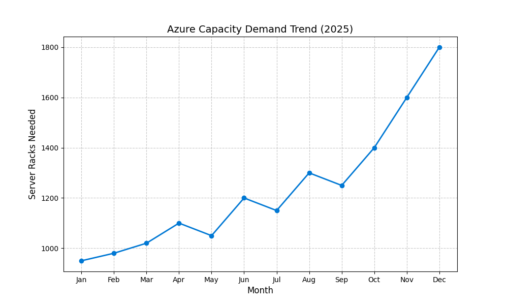

# Digital Capacity Optimizer

**Author:** Sandesh Hegde  
**Status:** Active Development (Jan 2026)  
**License:** MIT  

---

## 📌 Overview

This project explores the application of classical **Operations Management (OM)** principles—specifically **Inventory Control Theory**—to modern Cloud Infrastructure (IaaS).

While traditional OM focuses on physical stock (widgets), this tool treats **server capacity** as a stochastic inventory problem. It aims to minimize **Total Cost of Ownership (TCO)** by balancing:

- **Holding Costs** (idle capacity)  
- **Stockout Costs** (service outages)

---

## 🎯 Objectives

- **EOQ Implementation**  
  Adapting the Economic Order Quantity model for reserved instance procurement.

- **Safety Stock Modeling**  
  Calculating buffer capacity based on demand volatility (σ).

- **Data Visualization**  
  Automated generation of supply/demand curves from usage logs.

---

## 📊 Results (Simulation Output)

The system currently analyzes **12 months of synthetic Azure usage data** to optimize procurement strategies.

### 1. Demand Visualization



### 2. Optimization Report

Running the simulation on the **Munich Data Center** dataset yields:

```text
✅ Optimal Order Quantity (EOQ): 848.53 units
   -> Strategy: Buy servers in batches of ~850 to minimize holding costs.

🛡️ Safety Stock Buffer: 299.07 units
   -> Reason: Buffers against 15.8-day average lead time volatility.
```

---

## 🛠️ Tech Stack

- **Language:** Python 3.11+
- **Analysis:** Pandas (data ingestion), NumPy (mathematics)
- **Visualization:** Matplotlib
- **Version Control:** Git

---

## 🚀 Usage

1. **Install dependencies**
   ```bash
   pip install -r requirements.txt
   ```

2. **Run the simulation**
   ```bash
   python main.py
   ```