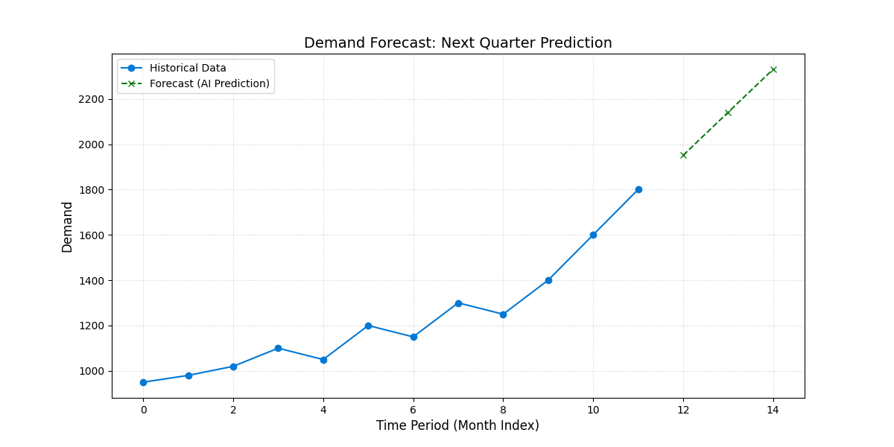

# Digital Capacity Optimizer

**Author:** Sandesh Hegde
**Status:** Active Development (Jan 2026)
**License:** MIT
 

---

## 📌 Overview

This project explores the application of **Operations Research** and **Predictive Analytics** to Cloud Infrastructure (IaaS).

It moves beyond simple averages by using **Holt-Winters Exponential Smoothing** to forecast future demand trends. It minimizes Total Cost of Ownership (TCO) by balancing:
- **Holding Costs** (Idle Capacity)
- **Stockout Costs** (Service Credits/Reputation Damage)

---

## 🎯 Objectives

- **Predictive Forecasting (AI)**
  Using `statsmodels` to predict future capacity needs based on historical growth trends.

- **Newsvendor Logic (Stochastic)**
  Calculating the mathematically optimal Service Level (e.g., 99.1%) based on the cost of downtime ($2,000/unit) vs. storage ($18.50/unit).

- **Automated Visualization**
  Generating trend lines and confidence intervals for executive reporting.

---

## 📊 Results (Predictive Mode)

The system detects a strong growth trend in the dataset and proactively adjusts procurement.

### 1. Demand Forecast (Next Quarter)


### 2. Proactive Analysis
Unlike reactive models that rely on past averages, the **Oracle Engine** projects forward:

```text
📊 PROACTIVE ANALYSIS
   -> Historical Avg Demand: 1233.3 units
   -> Predicted Next Month:  1950.9 units (Growth Trend)

🔮 RECOMMENDATION (Month 13):
   Buy 2561.32 units.
   (Buffers against volatility to hit a 99.1% Service Level Target)

---

## 🛠️ Tech Stack

- **Language:** Python 3.11+
- **Forecasting:** Statsmodels (hot-Winters)
- **Analysis:** Pandas, NumPy
- **Visualization:** Matplotlib

---

## 🚀 Usage

1. **Install dependencies**
   ```bash
   pip install -r requirements.txt
   ```

2. **Run the simulation**
   ```bash
   python main.py
   ```

---

## 🔮 Future Roadmap (Vision 2026-2030)
This project is the foundational layer of a **Digital Twin** for Cloud Supply Chains. The development roadmap transitions from static analytics to autonomous decision-making.

| Phase | Maturity Level | Key Capabilities | Tech Stack |
| :--- | :--- | :--- | :--- |
| **Phase 1 (Now)** | **Descriptive** | Static Rule-Based Logic (EOQ) | Python, Pandas |
| **Phase 2** | **Predictive** | ML Forecasting (Seasonality) | Scikit-Learn, SQL |
| **Phase 3** | **Cognitive** | "Chat with Data" (RAG) | Llama-3, Vector DBs |
| **Phase 4** | **Autonomous** | Self-Healing Supply Chain | Reinforcement Learning |