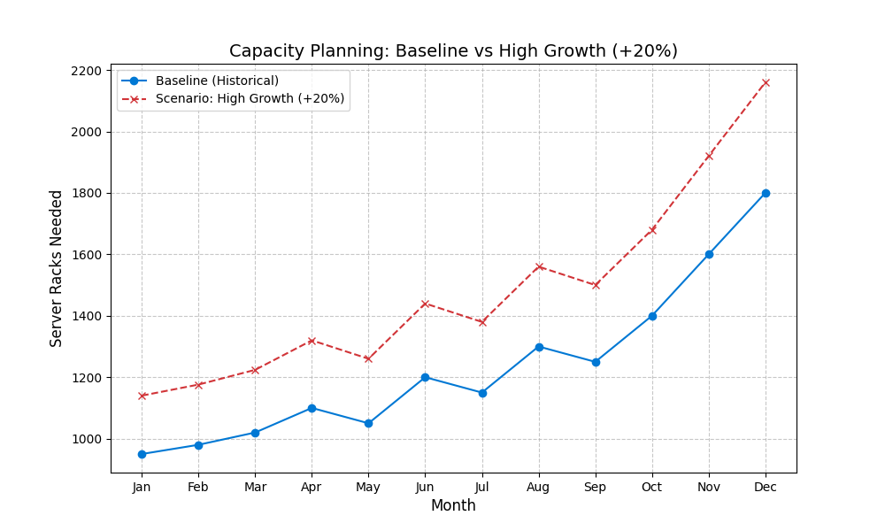

# Digital Capacity Optimizer
 

**Author:** Sandesh Hegde
**Status:** Active Development (Jan 2026)
**License:** MIT

---

## 📌 Overview

This project explores the application of classical **Operations Management (OM)** principles—specifically **Inventory Control Theory**—to modern Cloud Infrastructure (IaaS).

While traditional OM focuses on physical stock (widgets), this tool treats **server capacity** as a stochastic inventory problem. It aims to minimize **Total Cost of Ownership (TCO)** by balancing:

- **Holding Costs** (idle capacity)
- **Stockout Costs** (service outages)

---

## 🎯 Objectives

- **EOQ Implementation**
  Adapting the Economic Order Quantity model for reserved instance procurement.

- **Safety Stock Modeling**
  Calculating buffer capacity based on demand volatility (σ).

- **Scenario Planning (New v3.0)**
  Stress-testing supply chains against "High Growth" or "Supply Shock" events.

---

## 📊 Results (Scenario Analysis)

The system compares **Historical Baseline** vs. **High Growth (+20%)** scenarios to guide capacity planning.

### 1. Scenario Visualization


### 2. Impact Analysis
Simulating a 20% surge in cloud demand requires the following capacity adjustments:

```text
📊 SCENARIO COMPARISON REPORT
Metric               | Baseline        | High Growth     | Delta
-----------------------------------------------------------------
eoq                  | 848.53          | 929.52          | +80.99
safety_stock         | 299.07          | 362.33          | +63.26
total_reserve        | 1147.6          | 1291.85         | +144.25

---

## 🛠️ Tech Stack

- **Language:** Python 3.11+
- **Analysis:** Pandas (data ingestion), NumPy (mathematics)
- **Visualization:** Matplotlib (Multi-series plotting)
- **Version Control:** Git

---

## 🚀 Usage

1. **Install dependencies**
   ```bash
   pip install -r requirements.txt
   ```

2. **Run the simulation**
   ```bash
   python main.py
   ```

---

## 🔮 Future Roadmap (Vision 2026-2030)
This project is the foundational layer of a **Digital Twin** for Cloud Supply Chains. The development roadmap transitions from static analytics to autonomous decision-making.

| Phase | Maturity Level | Key Capabilities | Tech Stack |
| :--- | :--- | :--- | :--- |
| **Phase 1 (Now)** | **Descriptive** | Static Rule-Based Logic (EOQ) | Python, Pandas |
| **Phase 2** | **Predictive** | ML Forecasting (Seasonality) | Scikit-Learn, SQL |
| **Phase 3** | **Cognitive** | "Chat with Data" (RAG) | Llama-3, Vector DBs |
| **Phase 4** | **Autonomous** | Self-Healing Supply Chain | Reinforcement Learning |