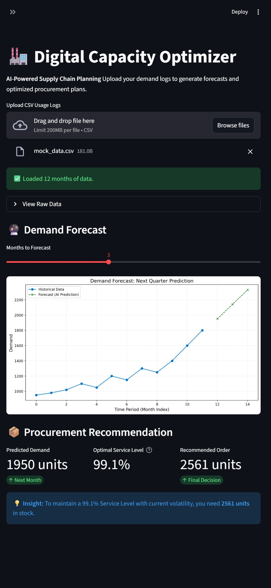

# 📦 Digital Capacity Optimizer

**Author:** Sandesh Hegde  
**Version:** v2.0.0 (Enterprise Edition)  
**License:** MIT  
  

## 🚀 Live Demo
**[Click here to launch the App](https://digital-capacity-optimizer.onrender.com/)**
*(Note: Hosted on Render Free Tier. Please allow 30s for the cold start.)*

---

## 📌 Overview

The **Digital Capacity Optimizer** is a Full-Stack Supply Chain Intelligence platform designed to replace fragile spreadsheet planning with a robust, database-backed application.

Unlike static dashboards, this system uses a **Persistent SQL Storage Layer** to track historical demand and applies **Probabilistic Modeling** to optimize inventory levels in real-time.

### 🖥️ The Interactive Dashboard
*(Make sure to upload your screenshot as `dashboard_ui.jpg` in the repo)*


---

## 🏗️ Architecture (v2.0)

The application follows a modern **3-Tier Architecture**:

1.  **Presentation Tier:** Streamlit (Interactive UI & Plotly Charts)
2.  **Application Tier:** Python Logic (Forecasts & Financial Risk Models)
3.  **Data Tier:** PostgreSQL (Production) / SQLite (Local Dev)

**Deployment:** The system is fully containerized using **Docker** and deployed on **Render** with an auto-migrating database strategy.

---

## 🎯 Key Features

- **🔌 Zero-Touch Data Loading:** Automatically connects to the SQL database on launch (no CSV drag-and-drop required).
- **📊 Interactive Visualizations:** Dynamic, zoomable demand charts powered by **Plotly**.
- **🔮 AI Forecasting Engine:** Uses **Holt-Winters Exponential Smoothing** to predict future demand trends.
- **💰 Financial Optimization:** Calculates **EOQ** (Economic Order Quantity) balancing Holding Costs vs. Stockout Penalties.
- **🧠 Smart Migration:** The system auto-detects schema changes and seeds the database from raw CSVs if the warehouse is empty.

---

## 📊 Results & Logic

The system utilizes **Newsvendor Logic** to financially justify inventory decisions.

```text
📊 PROACTIVE ANALYSIS
   -> Historical Avg Demand: 1,233 units
   -> Predicted Next Month:  1,950 units (Growth Trend)

🔮 RECOMMENDATION:
   Buy 2,561 units.
   (Includes safety buffer to maintain 99.1% SLA during growth phase)

```

---

## 🛠️ Tech Stack

* **Infrastructure:** Docker, Render (Cloud)
* **Database:** PostgreSQL (Prod), SQLite (Local), SQLAlchemy ORM
* **Frontend:** Streamlit, Plotly
* **Core Logic:** Python 3.11, Pandas, SciPy, Statsmodels

---

## 🚀 Installation & Usage

### Option A: Run Locally (Python)

Ideal for development and testing.

```bash
# 1. Clone the repository
git clone https://github.com/sandesh-s-hegde/digital_capacity_optimizer.git
cd digital_capacity_optimizer

# 2. Install dependencies
pip install -r requirements.txt

# 3. Initialize the Database
# This script creates the DB file and loads mock data automatically.
python migrate_csv_to_sql.py

# 4. Launch the Dashboard
streamlit run app.py

```

### Option B: Run with Docker

Ideal for production-grade deployment.

```bash
# 1. Build the container
docker build -t digital-capacity-optimizer .

# 2. Run the container
# The Dockerfile automatically handles the DB migration on start.
docker run -p 8501:8501 digital-capacity-optimizer

```

Access the app at `http://localhost:8501`

---

## 🔮 Future Roadmap

This project is the foundational layer of a Digital Twin for Cloud Supply Chains.

| Phase | Maturity Level | Key Capabilities | Tech Stack |
| --- | --- | --- | --- |
| Phase 1 (Done) | Descriptive | Static Rule-Based Logic (EOQ) | Python, Pandas |
| Phase 2 (Done) | Predictive | Dockerized Web App + SQL Database | PostgreSQL, Docker |
| Phase 3 (Next) | Cognitive | "Chat with Data" (RAG) | Gemini API, Vector DBs |
| Phase 4 | Autonomous | Self-Healing Supply Chain | Reinforcement Learning |
